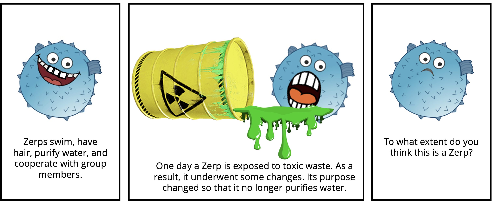

# Teleological properties

This repository contains the experiments, data, analyses, and figures for the paper "Property types in generic and specific statements: Teleological properties matter more for categorization," by David Rose, Siying Zhang and Tobias Gerstenberg.

The preprint can be found [here](UPDATEME)

__Contents__:
- [Introduction](#Introduction)
- [Repository structure](#Repository-structure)

## Introduction



<br clear="left" />
<br clear="right" />

What kinds of properties matter most in categorization? And does the way in which properties are attributed, either in generic (e.g., "Bees are striped") or specific (e.g., "This bee is striped") statements, matter in categorization. To address these questions, we utilized classic tests of essentialist thinking --- transformation, induction and offspring tasks -- and focused on biological, behavioral, social and teleological properties in categorizing novel animals. In Experiment 1, participants categorized properties as being either behavioral, biological, social, or teleological. In Experiment 2, we used the top four properties from each group to describe a generic noun or a specific individual. Utilizing a transformation tasks, participants then categorized creatures that had one of their properties transformed. We found that changes to teleological properties had the strongest impact on categorization judgments. Whether the statement was generic or specific made no difference. In Experiment 3, which involved an induction task, we also found that teleological properties mattered more and that whether the statement was generic or specific didn't make a difference in people's categorization judgments. In our final experiment, Experiment 4, we used an offspring task and found that teleological properties mattered more in categorizing offspring. And here we found that generic statements mattered more than specific ones in people's categorization judgments. Our findings add to work suggesting that generics may not specifically promote essentialism. But they do suggest that the type of property might matter in essentializing. Indeed, we suggest that teleological properties might play this privileged role in categorization because they are treated as essential properties.


## Repository structure

```

├── code
│   ├── R
│   │   ├── cache
│   ├── experiments
│   │   ├── experiment1
│   │   ├── experiment2
│   │   ├── experiment3
│   │   └── experiment4
│   └── python
├── data
│   ├── experiment1
│   ├── experiment2
│   ├── experiment3
│   └── experiment4
├── docs
│   ├── experiment2
│   ├── experiment3
│   ├── experiment4
└── figures
    ├── experiment1
    ├── experiment2
    ├── experiment3
    ├── experiment4


```

- `code/` contains all the code for the experiments, analyzing data and generating figures.
  - `experiments` contains code for each experiment that was run. Pre-registrations for all experiments may be accessed via the Open Science Framework [here](https://osf.io/kh3xa/)
  	- `experiment1` ([pre-registration](https://osf.io/4dux6)) was run in psiturk 
	- `experiment2` ([pre-registration](https://osf.io/a92nj)), `experiment3` ([pre-registration](https://osf.io/zdegq)) `experiment4` ([pre-registration](https://osf.io/2a3x5))and were run in jsPsych. These are copied in `docs` below where they can be rendered in your browser.
  - `python` contains scripts that were used to get the probabilities of sentence completions for properties used in experiment 2.
  - `R` contains the analysis scripts that were used to analyze data and generate figures
     (view a rendered file [here](https://cicl-stanford.github.io/teleological_properties/)).
- `data/` contains anonymized data from all experiments:
  - `experiment1` contains `experiment1.db` which includes trial and demographic data. 
  - `experiment2` contains `experiment2.csv` which includes the trial data and `experiment2_demographics.csv` which includes demographic data. The remaining files are for getting the probabilities of sentence completions from large language models for the properties used in experiment 2. 
  - `experiment3` contains `experiment3.csv` which includes the trial data for experiment 3 while `experiment3_demographics.csv` contains the demographic data.
  - `experiment4` contains `experiment4.csv` which includes the trial data for experiment 3 while `experiment4_demographics.csv` contains the demographic data.
- `docs/` contains all the experiment code for `experiment2`, `experiment3` and `experiment4`. You can preview the experiments below:
    - Experiment 2 - [Generic condition](https://cicl-stanford.github.io/teleological_properties/experiment2/index.html?condition=1),
      [Specific condition](https://cicl-stanford.github.io/teleological_properties/experiment2/index.html?condition=2)
    - Experiment 3 - [Generic condition](https://cicl-stanford.github.io/teleological_properties/experiment3/index.html?condition=1),
      [Specific condition](https://cicl-stanford.github.io/teleological_properties/experiment3/index.html?condition=2)
    - Experiment 4 - [Generic condition](https://cicl-stanford.github.io/teleological_properties/experiment4/index.html?condition=1),
      [Specific condition](https://cicl-stanford.github.io/teleological_properties/experiment4/index.html?condition=2)
- `figures/` contains all the figures from the paper (generated using the script in `code/R/`). 

## CRediT

| Term                       	| Definition                                                                                                                                                                                                    	| David Rose 	| Siying Zhang 	| Tobias Gerstenberg 	|
|----------------------------	|---------------------------------------------------------------------------------------------------------------------------------------------------------------------------------------------------------------	|------------	|--------------	|--------------------	|
| Conceptualization          	| Ideas; formulation or evolution of overarching research goals and aims                                                                                                                                        	| x          	| x            	| x                  	|
| Methodology                	| Development or design of methodology; creation of models                                                                                                                                                      	| x          	| x            	| x                  	|
| Software                   	| Programming, software development; designing computer programs; implementation of the computer code and supporting algorithms; testing of existing code components                                            	| x          	| x            	| x                  	|
| Validation                 	| Verification, whether as a part of the activity or separate, of the overall replication/ reproducibility of results/experiments and other research outputs                                                    	| x          	|              	| x                  	|
| Formal analysis            	| Application of statistical, mathematical, computational, or other formal techniques to analyze or synthesize study data                                                                                       	| x          	|              	| x                  	|
| Investigation              	| Conducting a research and investigation process, specifically performing the experiments, or data/evidence collection                                                                                         	| x          	| x            	|                    	|
| Data Curation              	| Management activities to annotate (produce metadata), scrub data and maintain research data (including software code, where it is necessary for interpreting the data itself) for initial use and later reuse 	| x          	| x            	|                    	|
| Writing - Original Draft   	| Preparation, creation and/or presentation of the published work, specifically writing the initial draft (including substantive translation)                                                                   	| x          	|              	|                    	|
| Writing - Review & Editing 	| Preparation, creation and/or presentation of the published work by those from the original research group, specifically critical review, commentary or revision – including pre-or postpublication stages     	| x          	| x            	| x                  	|
| Visualization              	| Preparation, creation and/or presentation of the published work, specifically visualization/ data presentation                                                                                                	| x          	|              	|                    	|
| Supervision                	| Oversight and leadership responsibility for the research activity planning and execution, including mentorship external to the core team                                                                      	| x          	|              	| x                  	|
| Project administration     	| Management and coordination responsibility for the research activity planning and execution                                                                                                                   	| x          	|              	| x                  	|
| Funding acquisition        	| Acquisition of the financial support for the project leading to this publication                                                                                                                              	|            	|              	| x                  	|
